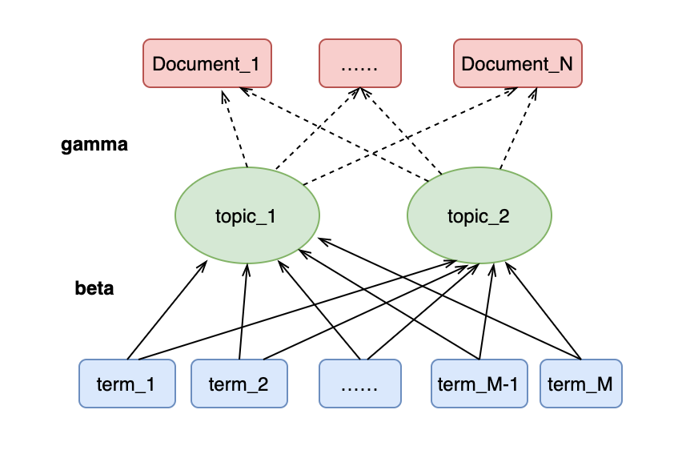

```{r message=FALSE, warning=FALSE}
library(tidyverse)
library(tidytext)
library(chinese.misc)
library(jiebaR)
library(topicmodels) # lda算法
library(broom)
library(ggplot2)
library(showtext)
library(ggridges)
library(ggsci)
library(ggplot2)
showtext_auto()
```

本文主要涉及两个知识点，一是由`tidy`生成`dtm`格式，二是进行`lda`建模。

# 一、从纯文本到tidy格式再到dtm

首先，和[上一节](https://plumberdong.netlify.app/2022/03/20/2022/)一样，我们生成一份tidy格式的《知否知否》数据。

```{r message=FALSE, warning=FALSE}
dat <- scancn("知否知否.txt")
dat <- str_split(dat, pattern = "\\s")[[1]]

# 去除空行，生成tibble
dat <- dat[dat!=""] %>%
  as_tibble()

# 生成章\回\句号
dat <- dat %>%
  rename(text = value) %>%
  mutate(id1 = cumsum(str_detect(text,
                                     pattern = "^第.+卷|^最终卷"))) %>%
  # 这里的回号不再于每一章开始时重置了
  mutate(id2 = cumsum(str_detect(text,
                                     pattern = "^第.+回"))) %>%
  filter(id2 != 0) %>%
  # 然后删除这些题目
  filter(!str_detect(text, patter = "^第.+卷|^最终卷|^第\\d+回")) %>%
  # 生成句子编号
  ungroup() %>%
  mutate(id3 = row_number())

# 创建分词工具
mycutter <- worker(user = "知否_人名.txt") 

# 进行分词;打散；
dat <- dat %>%
  mutate(text = seg_file(text, from = "v", mycutter = mycutter)) %>%
  tidytext::unnest_tokens(word, text, pattern = " ", token = stringr::str_split)

# 剔除停止词
my_stop <- read_lines("Chinese_StopWords.txt") %>%
  as_tibble() %>%
  rename(word = value)

dat1 <- dat %>%
  anti_join(my_stop, by = "word") %>%
  # 替换掉数字和英文字母
  mutate(word = gsub(pattern = "\\d+|[A-Za-z]+",replacement = "", x = word)) %>%
  filter(word != "")

rm(list = c("mycutter", "dat", "my_stop"))

head(dat1)
```

很多数据挖掘算法基于的格式是`dtm`。`dtm`是*Document-Term Matrix*的缩写。它本质上是一个大矩阵，行为对应节(document)，列为对应词项(term)，单元格内为对应词于对应节中出现的次数。

将`tidy`格式转化为`dtm`，需要用到`cast_dtm`函数。传递的三个参数为定义的节`document`，词项`term`以及词项出现的频次。

更多与tidy格式相关的转换方法，可以参见[**Text Mining in R**](https://www.tidytextmining.com/dtm.html)。

```{r message=FALSE, warning=FALSE}
my_dtm <- dat1 %>%
  group_by(id2) %>%
  count(word) %>%
  cast_dtm(id2, word, n) # cast_dtm
```

# 二、主题建模

生成`dtm`之后，就可以进行主题建模(`topic modeling`)了。主题模型的结构如图1所示：

```{r echo=FALSE, fig.align="center", fig.cap="主题模型图解"}

```

我们假设在document和term（在本案例中为小节和词）之间存在一个topic层，topic的数量是一个超参数，需要主观判断选取。

有两组参数需要估计，$\beta$代表了某一topic中对应term出现的概率，$\gamma$则是某一document中有多少百分比的内容由对应topic生成。


对这些参数进行估计的方法主要是LDA（Latent Dirichlet allocation）。通过`topicmodels`中的`lda`函数可以调用该方法进行拟合，这里先设置两个主题`k=2`。

```{r}
my_lda <- LDA(my_dtm, 
              k = 2, # 两个主题
              control = list(seed = 1234))
```

## (一) 主题和词的关系

下面是`per-topic-per-word probabilities`，即每个topic中对应词出现的概率。

```{r}
my_topics <- tidy(my_lda, matrix = "beta")
my_topics %>% head(10)
```

下面绘制了各主题中最常出现的10个词：

```{r fig.align="center", fig.cap="两主题中分别出现概率最高的10个词"}
my_top_terms <- my_topics %>%
  group_by(topic) %>%
  slice_max(beta, n = 10) %>% 
  ungroup() %>%
  arrange(topic, -beta)

my_top_terms %>%
  mutate(term = reorder_within(term, beta, topic)) %>%
  ggplot(aes(beta, term, fill = factor(topic))) +
  geom_col(show.legend = FALSE) +
  facet_wrap(~ topic, scales = "free") +
  scale_y_reordered() + 
  labs(x = "概率", y = NULL) + 
  scale_fill_aaas()
```

这是两个主题中对应词的对数发生比：

```{r fig.align="center", fig.cap="两主题对应词的对数发生比"}
beta_wide <- my_topics %>%
  mutate(topic = paste0("topic", topic)) %>%
  pivot_wider(names_from = topic, values_from = beta) %>% 
  filter(topic1 > .0023 | topic2 > .0023) %>% # 大于0.001概率出现
  mutate(log_ratio = log2(topic2 / topic1))

beta_wide %>%
  ggplot(aes(x= reorder(term, log_ratio), y = log_ratio)) +
  geom_col() + 
  coord_flip() +
  labs(x = NULL)
```

## （二）小节和主题的关系

下面给出了对于各小节，分别有多少比例的词是由特定主题生成的。

```{r}
my_documents <- tidy(my_lda, matrix = "gamma")
my_documents %>% head(10)
```

可以看下各小节由主题1生成的内容占比情况：

```{r fig.align="center", fig.cap="不同小节中由内容1生成的内容占比"}
my_documents %>%
  filter(topic == 1) %>%
  ggplot(aes(x = as.numeric(document), y= gamma)) + 
  geom_col()
```

## （三）多主题

之前我们只设置了2个主题。现在设置5个主题，看看基于这5个主题，是否能把五个章节区分开：

```{r}
my_lda_5 <- LDA(my_dtm, 
              k = 5, # 两个主题
              control = list(seed = 1234))
```

这是5个主题中出现概率最高的十个词：

```{r fig.align="center", fig.cap="5主题中分别出现概率最高的10个词"}
my_topics_5 <- tidy(my_lda_5, matrix = "beta")

my_top_terms_5 <- my_topics_5 %>%
  group_by(topic) %>%
  slice_max(beta, n = 10) %>% 
  ungroup() %>%
  arrange(topic, -beta)

my_top_terms_5 %>%
  mutate(term = reorder_within(term, beta, topic)) %>%
  ggplot(aes(beta, term, fill = factor(topic))) +
  geom_col(show.legend = FALSE) +
  facet_wrap(~ topic, scales = "free") +
  scale_y_reordered() + 
  labs(x = "概率", y = NULL) + 
  scale_fill_aaas()
```

我们再看一下不同章的小节中，属于不同主题的成分占比：

```{r}
my_documents_5 <- tidy(my_lda_5, matrix = "gamma")

# 章(id1)和小节(id2)的对应表
document_and_id1 <- dat1 %>%
  select(id1, id2) %>%
  distinct(id1, id2)

my_documents_5 %<>% 
  mutate(document = as.integer(document)) %>%
  # 找到不同小节的对应章
  left_join(document_and_id1, by = c("document" = "id2"))

head(my_documents_5)
```

下图是不同章中，不同topic在小节中所占比例的概率密度分布。可以看到，区分效果并不是特别的好。从某种意义上说，这意味着五个章节并不是分属五个区别明显的主题。

```{r message=FALSE, warning=FALSE, fig.align="center", fig.cap="不同章节中不同topic在各小节所占比例的分布情况"}
my_documents_5 %>%
  ggplot(aes(x = gamma, y = factor(topic), fill = factor(topic))) + 
  geom_density_ridges(alpha = .8, color = "white") + 
  facet_wrap(~id1) + 
  theme_ridges() + 
  theme(legend.position = "none") + 
  scale_fill_futurama() + 
  labs(y = "核密度", x = "所占比例")
```


